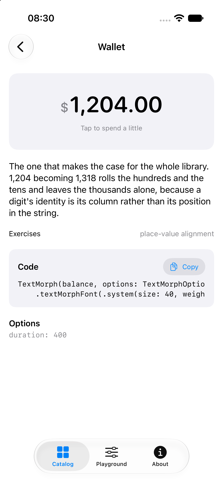
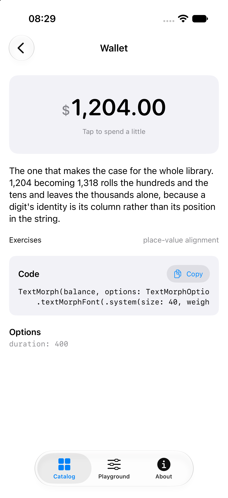
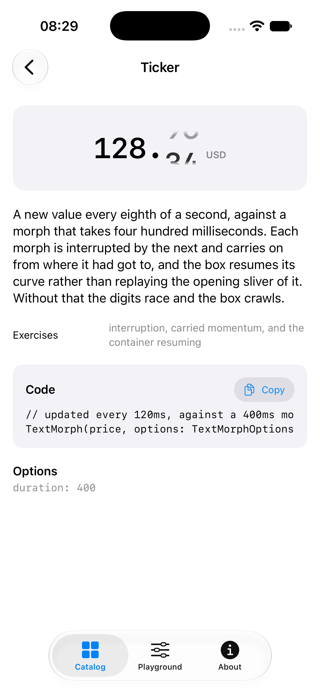
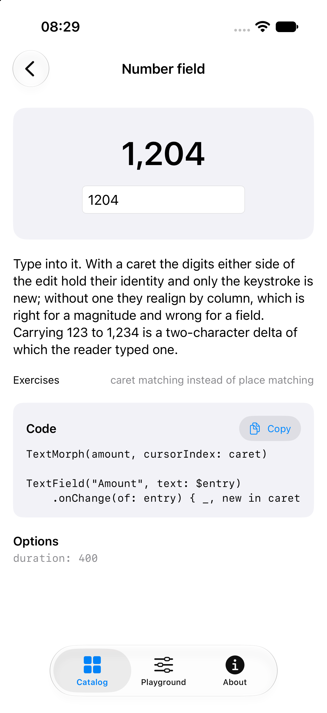
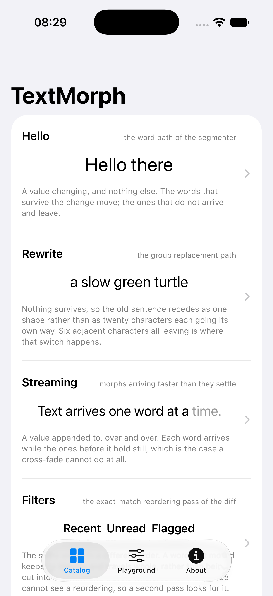
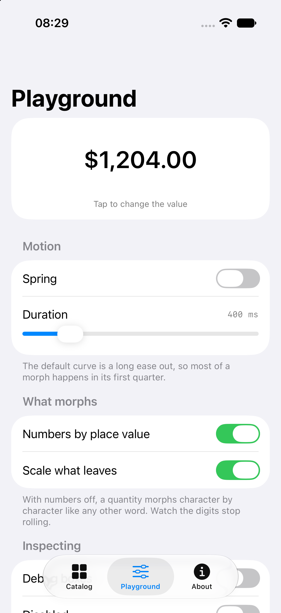
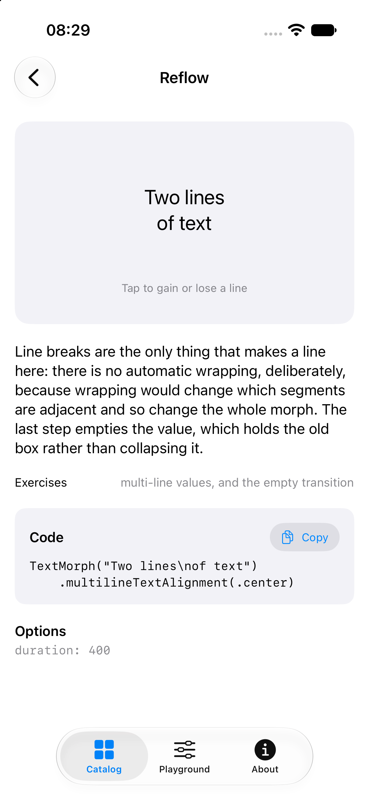

<div align="center">

# TextMorph for SwiftUI

**A native SwiftUI port of [Torph](https://torph.lochie.me) by [Lochie Axon](https://github.com/lochie).**

Text continuity for native interfaces. When a value changes, the characters,
words and digits that survive the change move to their new place instead of
disappearing in a cross-fade.

[](https://github.com/dim971/textmorph-ios/actions/workflows/ci.yml)
[](https://swift.org)
[](#requirements)
[](#installation)
[](LICENSE)



</div>

A number is the case that makes the argument. 1,204 becoming 1,318 rolls the
hundreds and the tens and leaves the thousands alone, because a digit's
identity is its column rather than its position in the string. A cross-fade
cannot do that, and neither can a view that animates a string.

```swift
TextMorph(total, options: TextMorphOptions(decimals: 2))
    .textMorphFont(.system(size: 40, weight: .semibold))
```

Its twin is [textmorph-android](https://github.com/dim971/textmorph-android).
The two ports mirror each other file for file and replay the same fixtures.

## Contents

- [Requirements](#requirements)
- [Installation](#installation)
- [Quick start](#quick-start)
- [Options](#options)
- [Numbers](#numbers)
- [Motion and accessibility](#motion-and-accessibility)
- [Fidelity](#fidelity)
- [Showcase app](#showcase-app)
- [Documentation](#documentation)
- [Contributing](#contributing)
- [Credits](#credits)
- [Licence](#licence)

## Requirements

iOS 17 or macOS 14 upwards, Swift 6. No dependencies.

## Installation

```swift
.package(url: "https://github.com/dim971/textmorph-ios", from: "0.1.0")
```

```swift
import TextMorph
```

## Quick start

```swift
struct Balance: View {
    @State private var total = 1204.0

    var body: some View {
        HStack(alignment: .firstTextBaseline, spacing: 4) {
            Text("Total")
                .foregroundStyle(.secondary)
            TextMorph(total, options: TextMorphOptions(decimals: 2))
        }
        .textMorphFont(.textStyle(.largeTitle))
        .onTapGesture { total -= 86 }
    }
}
```

A morph shapes its own text, so it needs a font it can measure, and SwiftUI's
`Font` is not one: it can be handed to a `Text` and to nothing else. So the
font is described with `.textMorphFont(_:)` and the colour with
`.textMorphColour(_:)`, and `.font(_:)` and `.foregroundStyle(_:)` have no
effect on a morph. Align on baselines rather than frames: a morph publishes its
first baseline, and its box is the font's own metrics rather than the one
SwiftUI gives a `Text`.

## Options

| Option | Default | What it does |
| --- | --- | --- |
| `duration` | `400` | How long a morph takes, in milliseconds. Ignored for a spring. |
| `ease` | `.default` | A cubic bezier or a spring. The default is a long ease out. |
| `scale` | `true` | Whether a leaving segment shrinks as it goes. |
| `numbers` | `true` | Whether a quantity morphs by place value. |
| `decimals` | `nil` | Fraction digits, minimum and maximum. `nil` means at most three. |
| `locale` | `en` | The decimal separator, and how a number is formatted. |
| `debug` | `false` | Outlines every segment by what it is doing. |
| `disabled` | `false` | The value arrives already in place. |
| `respectReducedMotion` | `true` | Whether the system setting does the same. |

Exactly one of `onComplete` and `onCancel` runs per morph, enforced by a
single-shot token rather than by care.

## Numbers

A quantity is recognised strictly, and on purpose: `$1,234.56`, `12%`, `(12)`
and `-5` are quantities, while `COVID-19`, `2024-01-01` and `v1.4.2` are not,
so a date or a version morphs character by character. Digits pair by column
from the decimal separator, arriving from above while the symbols around them
arrive from below.

A field being typed into wants a different answer, and gets one from
`cursorIndex`: both sides of the caret hold their identity and only the
keystroke is new.

<p align="center">



</p>

See [docs/numbers.md](docs/numbers.md).

## Motion and accessibility

The clock is linear and every curve is applied by the library, because upstream
animates transforms with the author's curve and opacity linearly over a
fraction of the duration. A spring is solved here rather than delegated: no
platform spring exposes its settling threshold, and the settling duration is
what every fade window is a fraction of.

The system's reduce-motion setting turns the morphing off on its own. The plain
value is exposed as one accessibility label, so VoiceOver reads the value and
not sixty fragments of it. Dynamic Type is honoured for a text style, and for a
fixed size when asked for.

One honest limitation: a morph draws its own glyphs, so **the value cannot be
selected**, in any mode. It is for values a reader watches change. Body copy
wants `Text`.

## Fidelity

The engine is pinned to the JavaScript original by 8770 cases generated from
the published `torph@0.1.3` package, plus the 2710 cases of Unicode's own UAX
#29 conformance suite. There is one tolerance in the whole suite and
[docs/fidelity.md](docs/fidelity.md) says exactly where it is and why.

Four deviations are deliberate, and one of them is a fix: at a damping ratio of
exactly one, upstream's spring divides by zero and reports a duration of minus
zero, so `damping: 20` at the default stiffness animates nothing. This port
adds the analytic critical branch, identically on both platforms.

## Showcase app

Fifteen demos, each naming the one capability of the engine it exists to show,
plus a playground where an option can be watched on and off over the same
value.

<p align="center">



</p>

```sh
make showcase
```

## Documentation

| Document | What it covers |
| --- | --- |
| [getting-started.md](docs/getting-started.md) | Installing it, and the first few things to try |
| [api.md](docs/api.md) | Every option, both utilities, and what this is not |
| [numbers.md](docs/numbers.md) | How a quantity rolls, and what counts as one |
| [architecture.md](docs/architecture.md) | How a value reaches the screen |
| [fidelity.md](docs/fidelity.md) | How this is held to the original |
| [coding-style.md](docs/coding-style.md) | The style contract, and what is enforced |

## Contributing

Issues and pull requests are both welcome. See
[CONTRIBUTING.md](CONTRIBUTING.md) for how to build it and what a review looks
for, and [CODE_OF_CONDUCT.md](CODE_OF_CONDUCT.md) for how to take part.

## Credits

[Torph](https://torph.lochie.me) is by [Lochie Axon](https://github.com/lochie).
The idea, the timing, the place-value alignment and the strictness about what
counts as a quantity are all his; this repository is the port.

## Licence

MIT. See [LICENSE](LICENSE). Torph is MIT, copyright 2025 Lochie Axon; see
[NOTICE](NOTICE) for the attribution and for exactly which files are derived
from it.
